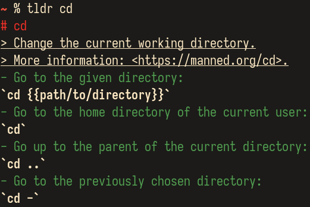

# tinytldr

Minimal [tldr][1] command line client in plain C99.

# PREVIEW



* Never gets in the way.
* Displays a page in ~12 ms.

*[srcery][2] - terminal colorscheme on the screenshot.*

# INSTALL

Satisfy the [dependencies](#dependencies) first, and then:

```bash
git clone https://github.com/kovmir/tinytldr.git
cd tinytldr
# Optional: Adjust ./config.h to your linking.
make
sudo make install
```

# USAGE

```bash
tldr -u # Fetch or update pages.
tldr cd # View 'cd' page.
tldr -p windows scoop # One could specify a platform.
tldr git apply # View git-apply.md
```

This implementation does not support [tldr-pages client specification][3], as
it makes clients identical for no reason and goes against the minimalist
approach of this project.

# DEPENDENCIES

* [Git][12]
* [GNU Make][4]
* [pkg-config][5]
* [GCC][6] or [Clang][7]
* [libarchive][8]
* [libcurl][9]

# SUPPORTED OPERATING SYSTEMS

* Linux
* BSD

# FAQ

**Q: Can I use it to display my personal pages?**

A: Yes, you can.

```bash
TLDR_PAGES="$HOME/.local/share/tinytldr/pages"
mkdir "$TLDR_PAGES/mypages"
echo '# My custom page' > "$TLDR_PAGES/mypages/testpage.md"
tldr testpage
```

# CREDITS

Thanks [@bilditup1](https://github.com/bilditup1) for code contributions.

# CONTRIBUTING

When submitting PRs, please maintain the [coding style][11] used for the
project.

[1]: https://tldr.sh/
[2]: https://srcery.sh/
[3]: https://github.com/tldr-pages/tldr/blob/main/CLIENT-SPECIFICATION.md
[4]: https://www.gnu.org/software/make/
[5]: https://gitlab.freedesktop.org/pkg-config/pkg-config
[6]: https://gcc.gnu.org/
[7]: https://clang.llvm.org/
[8]: https://www.libarchive.org/
[9]: https://curl.se/libcurl/
[11]: https://suckless.org/coding_style/
[12]: https://git-scm.com/
